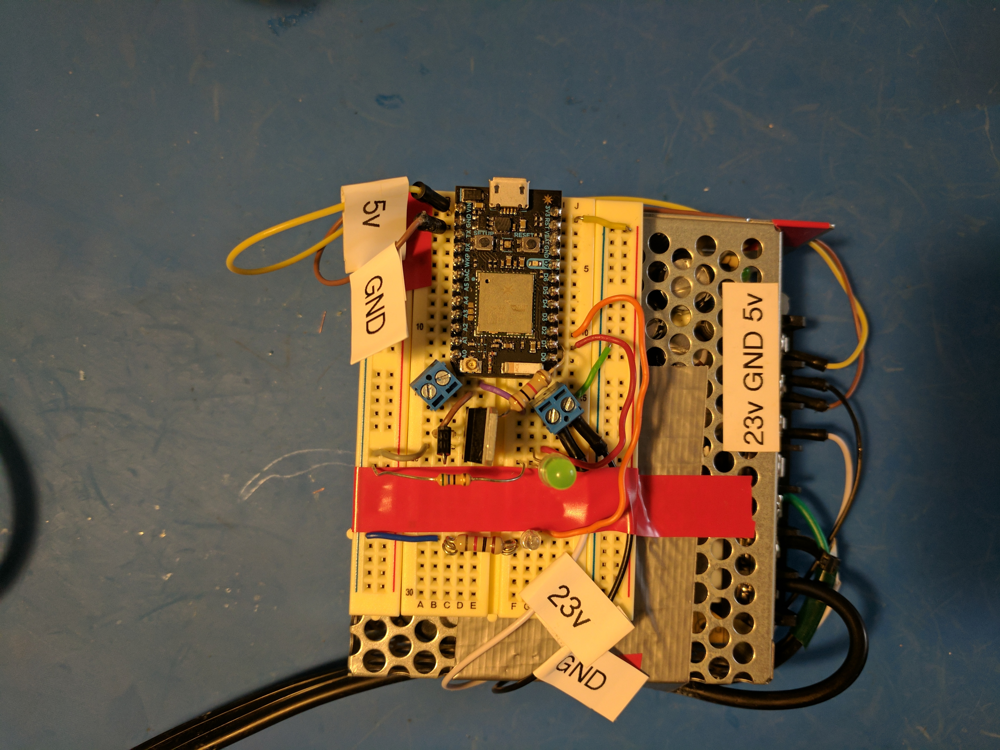

# alexaLights
----
My original intent was to integrate a Particle Photon board with an Amazon Echo device to control some devices using voice commands. In the process, I found projects by people who had done similar things (see references) and used those as guides. This is my attemt at bringing together a few of the things I learned on the way.


First, the user issues a voice command to the Amazon Echo device. The device sends the audio to Amazon's Alexa Voice service which 'tokenizes' the speech into a json format. It then gets routed to the specified endpoint (our AWS Lambda Function) and passes the tokenized values into the function call to Particle's API. This triggers our Particle Photon device to change state and return an *int* to the Lambda Function. The Lambda Function finishes the request and sends a voice response back for the Amazon Echo device along with an optional reference card for the companion app.

----
## Hardware and Particle

Let's start at the last step of the process; the Particle Photon. I wanted to control an LED strip which needed a voltage higher than what the Particle Photon could provide so I got a [power supply](https://www.amazon.com/gp/product/B005T7NIAI/ref=oh_aui_detailpage_o06_s00?ie=UTF8&psc=1) that could provide 24V for the LED strip and 5V for for the board. To switch this load I used a [TIP120](https://www.adafruit.com/product/976) Darlington transistor and wired it to the board according to the schematics. Finally, a [PIR sensor](https://www.adafruit.com/product/189) allows the controller to automatically turn the lights on/off if certain timers have elapsed.


The main loop in the Photon runs a state machine that reads any inputs, updates the status of pins, checks flags and timers, and remembers the last state of the input pin. The following lines of code connect the locally defined functions, *turnPinOnOff* and *partyFunc*, to Particle's cloud. This will allow us to call these functions from other code.
```C
    Spark.function("myFunction", turnPinOnOff);
    Spark.function("globalParty", partyFunc);
```
Calling the function will trigger a change in one of the flags or pin values and this gets picked up the next time the main loops runs through.

----
## Lambda Function

I won't go into detail on how to create an AWS account (you can see the tutorials on the references for more details) but I'll touch on some points that I think are important. The relevant files for the Lambda Function are in the *customSkill/src/* directory (more about Smart Home Skills in a bit). You will need to edit the *sampleConfig.js* file with your Particle board's information, your deviceID and acccesToken, and rename it to *config.js*. 
The main code is in *index.js* file but before we take a look at it we must understand the structure of an Alexa Custom Skill command. A command consists of a **wake word**, Alexa, an **invocation name** and an **intent** with optional **slots**.


The Lambda Function receives the aforementioned parameters in a JSON format (more on this later), switches to the appropiate case based on the **intent**, uses the **slots** to construct a message, and sends it off to the Particle board. Many Intents can be assigned to the Custom Skill giving it much more versatility than a Smart Home Skill. 

We can also design a response card to the companion Alexa App that can display extra information for the user. The fastest way to get up and running is to select *AlexaSkill.js, config.js, index.js* zip them, and upload directly to the Lambda Function page.

For the user, the main difference between a Custom Skill and a Smart Home Skill is the way in which it's called. A Smart Home Skill does not need an invocation name, so our command would be _'Alexa, turn the Kitchen Lights On'_. This is much easier to remember but unfortunately the backend limits the responses back to the users and requires an OAuth to authenticate with your device making things a bit more complicated. I was not able to succesfully authenticate with my Particle device but I put the code up anyways in case anyone wants to try it. That's in the _smartHomeSkill/_ directory.

----
## Alexa Skills Kit (ASK)

This part of the code is responsible for defining your **invocation name**, **intents**, and **slots** (code can be found in *customSkill/speechAssets/*). The Interaction Model of the Custom Skill contains Sample Utterances that are used to correctly identify your request. For example, the *onOffIntent* is defined by the phrase ('Alexa, *tell/ask* *The House*' is assummed) 'to turn the _Kitchen Lights_ _Off_'. 
```
onOffIntent to turn the {deviceName} {onOrOff}
```
The Intent Schema connects your Sample Utterances to the JSON format in which it will get passed to the Lambda Function. For the onOffIntent we have the following Intent Schema:

``` javascript
{
 "intents": [
   {
    "intent": "onOffIntent",
     "slots": [
       {
        "name": "onOrOff",
        "type": "ON_OFF"
       },
       {
        "name": "deviceName",
        "type": "DEVICE_NAMES"
       }
      ] 
   }
  ]
}
```
The last important part of the Alexa Skill Kit are the Custom Slot Types which are like macros. For example:
```
DEVICE_NAMES
kitchen lights
living room lights
```

----
## Result

Picture and video:

[](https://youtu.be/mKf3mUwAYDs)
----


## References:

##### Custom Skill:
* [alexaParticleBridge](https://github.com/rlisle/alexaParticleBridge)
* [Particle_Alexa](https://github.com/krvarma/Particle_Alexa)

##### Smart Home Skill:
* [Steps to Create a Smart Home Skill](https://developer.amazon.com/public/solutions/alexa/alexa-skills-kit/docs/steps-to-create-a-smart-home-skill)
* [particle-alexa-smart-home-skill](https://github.com/krvarma/particle-alexa-smart-home-skill) 

##### To-do:
* [Push Notifications](https://forums.developer.amazon.com/questions/40799/workaround-for-push-notifications.html)

---

You can see more of my projects at [here](http://ajumpa.com/)

